# 機能・設計意図メモ

---

## 🗺️ プロジェクト全体構成図

```mermaid
flowchart TD
    A[main.py\nアプリ起動・例外フック] --> B[modules/ui_main.py\nUIメイン/TagManagerApp]
    B --> C1[modules/tag_manager.py\nDB管理/タグ操作]
    B --> C2[modules/dialogs.py\nダイアログUI]
    B --> C3[modules/theme_manager.py\nテーマ管理]
    B --> C4[modules/constants.py\n定数・設定]
    C1 --> D1[data/tags.db\nタグDB]
    C1 --> D2[backup/tags_backup_*.db\nバックアップ]
    B --> E1[resources/config/*.json\n各種設定・カテゴリ・タグ]
    B --> E2[resources/icons/*.ico\nアイコン]
    B --> F1[logs/app.log\nエラーログ]
    B --> F2[theme_settings.json\nテーマ設定]
    B --> G1[run_app.bat\nアプリ起動バッチ]
    B --> G2[run_tests.bat\nテストバッチ]
    B --> H1[tests/\n自動テスト群]
    B --> I1[README.md\nドキュメント]
    B --> I2[AI_REFERENCE_GUIDE.md\nAI開発ガイド]
    B --> I3[技術仕様書_関数・ファイルパス一覧.md\n仕様書]
    B --> I4[ToDoリスト.md\n進捗管理]
    B --> J1[archive/\n参考・廃止ファイル]
    B --> J2[venv/ .venv/ ENV/ env/\n仮想環境]
    style A fill:#f9f,stroke:#333,stroke-width:2px
    style B fill:#bbf,stroke:#333,stroke-width:2px
    style C1 fill:#bfb,stroke:#333,stroke-width:1px
    style C2 fill:#bfb,stroke:#333,stroke-width:1px
    style C3 fill:#bfb,stroke:#333,stroke-width:1px
    style C4 fill:#bfb,stroke:#333,stroke-width:1px
    style D1 fill:#ffd,stroke:#333,stroke-width:1px
    style D2 fill:#ffd,stroke:#333,stroke-width:1px
    style E1 fill:#ffd,stroke:#333,stroke-width:1px
    style E2 fill:#ffd,stroke:#333,stroke-width:1px
    style F1 fill:#fcc,stroke:#333,stroke-width:1px
    style F2 fill:#fcc,stroke:#333,stroke-width:1px
    style G1 fill:#eee,stroke:#333,stroke-width:1px
    style G2 fill:#eee,stroke:#333,stroke-width:1px
    style H1 fill:#cfc,stroke:#333,stroke-width:1px
    style I1 fill:#eef,stroke:#333,stroke-width:1px
    style I2 fill:#eef,stroke:#333,stroke-width:1px
    style I3 fill:#eef,stroke:#333,stroke-width:1px
    style I4 fill:#eef,stroke:#333,stroke-width:1px
    style J1 fill:#eee,stroke:#333,stroke-width:1px
    style J2 fill:#eee,stroke:#333,stroke-width:1px
```

---

## main.py（A）
- アプリケーションのエントリポイント。
- 例外フックで予期せぬエラーをダイアログ表示。
- TagManagerApp（UIメインクラス）を起動し、メインループを開始。

## modules/ui_main.py（B）
- TagManagerAppクラスで全UI構築・イベント処理を担当。
- カテゴリ・タグの表示、編集、出力、テーマ切替、DBバックアップ等の主要機能を統括。
- 設計意図：UI/UXの一元管理と、ユーザー操作の一貫性確保。

## modules/tag_manager.py（C1）
- タグ情報のDB管理（追加・編集・削除・検索・翻訳・カテゴリ付与・お気に入り等）。
- SQLiteを用いたタグ・最近使ったタグの永続化。
- 設計意図：タグデータの信頼性・一貫性確保と、UI層からの分離。

## modules/dialogs.py（C2）
- カテゴリ選択や一括カテゴリ変更など、ユーザー入力用のダイアログUIを提供。
- 設計意図：複雑な入力や確認操作をモーダルダイアログで安全に実装。

## modules/theme_manager.py（C3）
- テーマ設定の保存・読込・切替を担当。
- 利用可能なテーマ一覧の提供。
- 設計意図：ユーザーごとのUIテーマカスタマイズを容易にし、設定の永続化を実現。

## modules/constants.py（C4）
- 各種定数・設定ファイルパス・カテゴリキーワードの管理。
- 設計意図：設定値の一元管理と、ハードコーディング防止。

## data/tags.db（D1）
- タグ情報を永続化するSQLiteデータベース。
- 設計意図：タグ・カテゴリ・お気に入り等のデータをアプリ全体で一元管理。

## backup/tags_backup_*.db（D2）
- タグDBのバックアップファイル。
- 設計意図：データ消失や破損時のリカバリ用。

## resources/config/*.json（E1）
- 各種設定・カテゴリ・タグ情報のJSONファイル。
- 設計意図：UIや自動分類、補完、履歴等の柔軟な拡張を実現。

## resources/icons/*.ico（E2）
- アプリケーションのアイコンファイル。
- 設計意図：Windows等でのショートカットやウィンドウ表示用。

## logs/app.log（F1）
- アプリケーションのエラーログ。
- 設計意図：例外やエラー発生時の記録・デバッグ用。

## theme_settings.json（F2）
- 現在選択中のUIテーマ名を保存。
- 設計意図：ユーザーごとのテーマ設定を永続化。

## run_app.bat（G1）
- 仮想環境の自動セットアップ・依存ライブラリインストール・アプリ起動を一括実行するバッチ。
- 設計意図：初回利用者や非エンジニアでも簡単にアプリを起動できるようにする。

## run_tests.bat（G2）
- テスト実行用バッチ。
- 設計意図：pytestによる自動テストをワンクリックで実行可能に。

## tests/（H1）
- 各種自動テスト群。
- 設計意図：機能ごとの品質保証と、将来のリファクタ時の安全性確保。

## README.md, AI_REFERENCE_GUIDE.md, 技術仕様書_関数・ファイルパス一覧.md, ToDoリスト.md（I1〜I4）
- プロジェクトの概要・使い方・開発手順・構成・進捗管理・AI開発ガイド・仕様書。
- 設計意図：利用者・開発者へのドキュメント提供。

## archive/（J1）
- 古いデータや一時的な退避ファイル用ディレクトリ。
- 設計意図：不要になったファイルの保管や履歴管理。

## venv/, .venv/, ENV/, env/, virtualenv/（J2）
- Python仮想環境ディレクトリ。
- 設計意図：依存パッケージの隔離と、システム環境への影響防止。 